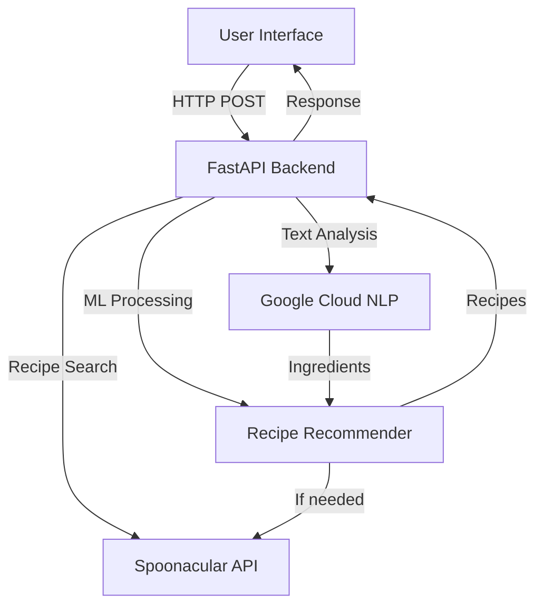

# Ingreedy - AI Recipe Chatbot

Ingreedy is an AI-powered recipe chatbot that helps you find recipes based on ingredients you have at home. Simply tell the chatbot what ingredients you have, and it will suggest recipes you can make.

## Features

- **Ingredient-based Recipe Search**: Find recipes based on ingredients you have
- **Natural Language Understanding**: Uses Google Cloud Natural Language API for advanced text analysis
- **Smart Recommendations**: Uses machine learning to find suitable recipes even without exact matches
- **Conversational Interface**: Chat naturally with the bot to discover recipes
- **Recipe Details**: View full ingredients, instructions, and nutritional information
- **Indian Cuisine Focus**: Specialized in Indian recipes with ingredient variations support

## Tech Stack

- **Backend**: Python with FastAPI
- **Machine Learning**: 
  - K-means clustering and TF-IDF for ingredient matching
  - Google Cloud Natural Language API for text analysis
- **Frontend**: HTML, CSS, JavaScript
- **API**: Spoonacular Recipe API for comprehensive recipe data
- **Data Processing**: Pandas for data manipulation

## Data Flow Diagram



## Setup and Installation

1. Clone the repository:
   ```bash
   git clone https://github.com/SaiSrikar0/Ingreedy-1.1.git
   cd Ingreedy-1.1
   ```

2. Create a virtual environment and install dependencies:
   
   **Windows:**
   ```bash
   python -m venv venv
   venv\Scripts\activate
   pip install -r requirements.txt
   ```
   
   **macOS/Linux:**
   ```bash
   python3 -m venv venv
   source venv/bin/activate
   pip install -r requirements.txt
   ```

3. Create a `.env` file in the root directory with your API keys:
   ```env
   # API Keys
   SPOONACULAR_API_KEY=your_api_key_here
   GOOGLE_APPLICATION_CREDENTIALS=path_to_your_google_credentials.json

   # Application Settings
   DEBUG=False
   LOG_LEVEL=INFO

   # Recipe Settings
   MAX_RECIPES_PER_SEARCH=20
   MIN_LOCAL_RECIPES=3
   PRIORITY_SOURCES=indianhealthyrecipes.com,vegrecipesofindia.com,hebbarskitchen.com,archanaskitchen.com
   ```

4. Set up Google Cloud Natural Language API:
   - Create a project in Google Cloud Console
   - Enable the Natural Language API
   - Create a service account and download the credentials JSON file
   - Set the GOOGLE_APPLICATION_CREDENTIALS environment variable to point to your credentials file

5. Run the application:
   
   **Windows:**
   ```bash
   python run.py
   ```
   
   **macOS/Linux:**
   ```bash
   python3 run.py
   ```

6. Open your browser and go to `http://localhost:8001`

## Usage Examples

- "What can I make with eggs and potatoes?"
- "I have chicken, broccoli, and rice"
- "Show me vegetarian recipes with mushrooms"
- "What can I cook with pasta and tomatoes?"
- "Find recipes with paneer and spinach"
- "Show me Indian recipes with rice and dal"

## System Requirements

### Software Requirements

1. **Operating System**:
   - Windows 10/11
   - macOS 10.15 (Catalina) or newer
   - Ubuntu 20.04 or newer (or other Linux distributions with equivalent packages)

2. **Python Version**: 3.8 or newer

3. **Dependencies**: See requirements.txt for specific versions

4. **Frontend**:
   - Modern web browser with JavaScript enabled:
     - Google Chrome 90+
     - Mozilla Firefox 88+
     - Microsoft Edge 90+
     - Safari 14+

### Hardware Requirements

1. **Minimum Requirements**:
   - Processor: Dual-core 2GHz or better
   - RAM: 4GB
   - Storage: 100MB free space
   - Network: Broadband internet connection

2. **Recommended Requirements**:
   - Processor: Quad-core 2.5GHz or better
   - RAM: 8GB or more
   - Storage: 500MB free space
   - Network: High-speed broadband connection

## Contributing

Contributions are welcome! Please feel free to submit a Pull Request.

1. Fork the repository
2. Create your feature branch (`git checkout -b feature/amazing-feature`)
3. Commit your changes (`git commit -m 'Add some amazing feature'`)
4. Push to the branch (`git push origin feature/amazing-feature`)
5. Open a Pull Request

## License

This project is licensed under the MIT License - see the [LICENSE](LICENSE) file for details.

## Acknowledgements

- [Spoonacular API](https://spoonacular.com/food-api) for providing recipe data
- [Google Cloud Natural Language API](https://cloud.google.com/natural-language) for advanced text analysis
- [FastAPI](https://fastapi.tiangolo.com/) for the efficient API framework
- [scikit-learn](https://scikit-learn.org/) for machine learning algorithms

## API Configuration

The application uses the Spoonacular API for recipe search and recommendations. To get started:

1. Sign up for a free account at [Spoonacular](https://spoonacular.com/food-api)
2. Get your API key from the dashboard
3. Add the API key to your `.env` file

The free tier of Spoonacular API includes:
- 150 points per day
- 10 requests per minute
- Access to basic recipe search and information

## Support

For support, please open an issue in the GitHub repository or contact the maintainers.